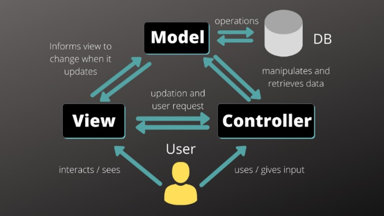

# Harta Interactivă Bazată pe Evenimente

## Overview al aplicației

## Tehnologii folosite

- **Django** – framework Python, utilizat pentru crearea interfeței.
- **Beautiful Soup** – parsare HTML  
  Biblioteca Beautiful Soup a fost folosită pentru a extrage informații relevante din paginile web.
- **MongoDB** – bază de date utilizată pentru stocarea informațiilor.
- **Apscheduler** – pentru executarea sarcinilor în fundal.  
  Acesta asigură că agregatorul este actualizat constant cu cele mai recente evenimente.

## Arhitectura Aplicației

