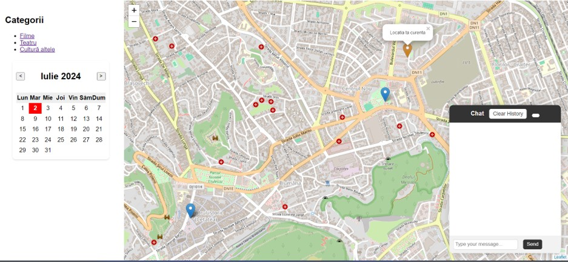
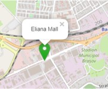

# Harta Interactivă Bazată pe Evenimente

## Overview al aplicației

## Tehnologii folosite

- **Django** – framework Python, utilizat pentru crearea interfeței.
- **Beautiful Soup** – parsare HTML  
  Biblioteca Beautiful Soup a fost folosită pentru a extrage informații relevante din paginile web.
- **MongoDB** – bază de date utilizată pentru stocarea informațiilor.
- **Apscheduler** – pentru executarea sarcinilor în fundal.  
  Acesta asigură că agregatorul este actualizat constant cu cele mai recente evenimente.

## Arhitectura Aplicației

## Chat Interactiv

Descoperi rapid evenimentele pe domeniul dorit.

|  |  |  |  |
|--------------------------|--------------------------|--------------------------|--------------------------|

## Navigare simplă

Poți vedea evenimente direct pe hartă sau după categorii.

|  |  |
|--------------------------|--------------------------|

## Exploararea evenimentelor direct pe hartă

|  |  |  |
|----------------------------|----------------------------|----------------------------|

|  |  |  |
|----------------------------|----------------------------|----------------------------|

## Calendar

Poți vedea ce evenimente vor avea loc și când, totodată și în trecut.

|  |  |
|----------------------------|----------------------------|

## Dezvoltări ulterioare

- **Localizare precisă**:
  Vezi evenimentele din jurul tău cu opțiunea de a seta o rază specifică (ex: evenimente într-o rază de 1 km) și să efectuezi o căutare a evenimentelor disponibile în jurul locației tale.

- **Crearea unui API pentru organizatori**:
  Permite organizatorilor să adauge și să gestioneze evenimente direct prin intermediul aplicației, având posibilitatea să creeze, să actualizeze și să ștergă evenimente.

- **Îmbunătățirea chat-ului**:
  Furnizarea informațiilor despre cum să ajungi la eveniment, generând trasee personalizate în funcție de locația curentă a utilizatorului.

- **Dezvoltarea unei aplicații mobile**:
  Disponibilă pentru platformele iOS și Android.

- **Extinderea funcționalităților de notificare**:
  Implementarea unui sistem de notificări push pentru utilizatori, care să îi anunțe despre evenimentele noi adăugate, modificări în detaliile evenimentelor și alte actualizări relevante.

- **Analiza și recomandări personalizate**:
  Monitorizarea interacțiunilor utilizatorilor cu aplicația și furnizarea recomandărilor personalizate de evenimente pe baza preferințelor și istoricului de vizualizare.

  ## Demo al Aplicației

Pentru a vedea demonstrația aplicației, accesează video-ul de mai jos:

